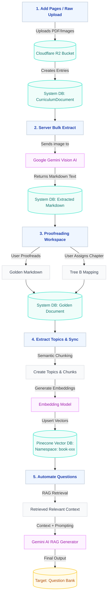

# Knowledge Hub Data Extraction & Processing Workflow

This flowchart explains the step-by-step process of how our Knowledge Hub takes raw images/PDFs and turns them into highly structured AI-generated questions.

