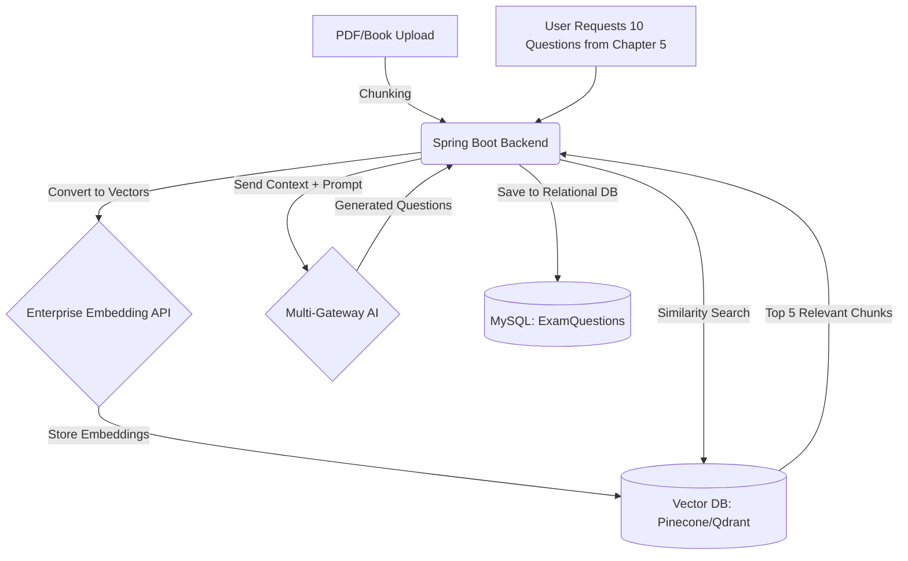

# 📚 QuestionShaper — Complete Project Architecture & Reference

> **Last Updated:** 2026-04-03  
> **Version:** 1.5  
> **Project:** QuestionShaper SaaS — Multi-Tenant Exam & Question Bank Management System


---

## 📋 Table of Contents

1. [Project Overview](#1-project-overview)
2. [Technology Stack](#2-technology-stack)
3. [Project Structure](#3-project-structure)
4. [Backend Architecture](#4-backend-architecture)
5. [Database / Entity Model](#5-database--entity-model)
6. [Multi-Tenancy Architecture](#6-multi-tenancy-architecture)
7. [Security & Authentication](#7-security--authentication)
8. [API Endpoints (Controllers)](#8-api-endpoints-controllers)
9. [Service Layer](#9-service-layer)
10. [Frontend Architecture](#10-frontend-architecture)
11. [Frontend Routing Map](#11-frontend-routing-map)
12. [Build & Deployment](#12-build--deployment)
13. [Key Features by Module](#13-key-features-by-module)
14. [Configuration Reference](#14-configuration-reference)
15. [Future Roadmap & AI Scaling Plans](#15-future-roadmap--ai-scaling-plans)
16. [Changelog / Update Log](#16-changelog--update-log)

---

## 1. Project Overview

**QuestionShaper** is a **multi-tenant SaaS platform** designed for educational institutions (schools, colleges, universities, coaching centers) in Bangladesh. It enables:

- **Question Bank Management** — Create, organize, import (Excel/API), and approve MCQ, CQ, Short, True/False questions
- **Exam Generation** — Auto-generate exams based on rules (difficulty distribution, chapter/topic) or manually build exams
- **Exam Editor** — Word-processor-like editor for customizing exam papers (header, sections, layout)
- **Exam Download** — Export as PDF (with Bangla font support via NotoSansBengali) and Word (DOCX via Apache POI)
- **Lecture Sheet Management** — Create sectioned lecture sheets with question attachments
- **Academic Structure** — Manage Classes → Subjects → Chapters → Topics hierarchy with Academic Sessions
- **Institute Management** — Multi-tenant institute registration, subscription plans, and admin panels
- **User Management** — Role-based access (SUPER_ADMIN, INSTITUTE_ADMIN, TEACHER, STUDENT) with user impersonation
- **Billing & Subscriptions** — Package management, invoicing, billing cycles (MONTHLY/YEARLY)
- **CMS** — Landing page editor and blog system (categories, tags, posts)
- **Reports** — Usage analytics and performance analytics dashboards
- **Settings** — General (branding), Security (rate limiting, session), Backup management

---

## 2. Technology Stack

### Backend
| Component | Technology | Version |
|---|---|---|
| **Framework** | Spring Boot | 3.2.3 |
| **Language** | Java | 17 |
| **Database** | MySQL | - |
| **ORM** | Spring Data JPA (Hibernate) | - |
| **Security** | Spring Security + JWT (jjwt 0.11.5) | - |
| **Object Mapping** | MapStruct | 1.5.5.Final |
| **PDF Generation** | OpenPDF | 1.3.43 |
| **Word Generation** | Apache POI (poi-ooxml) | 5.2.5 |
| **CSV Import** | OpenCSV | 5.9 |
| **HTML Parsing** | Jsoup | 1.17.2 |
| **Cloud Storage** | AWS SDK (S3/Cloudflare R2) | 2.20.162 |
| **Code Simplification** | Lombok | - |
| **Packaging** | WAR (for Tomcat deployment) | - |

### Frontend
| Component | Technology | Version |
|---|---|---|
| **Framework** | React | 18.2 |
| **Build Tool** | Vite | 5.1.4 |
| **Styling** | TailwindCSS | 3.4.1 |
| **Routing** | React Router DOM | 6.22.2 |
| **HTTP Client** | Axios | 1.6.7 |
| **Animations** | Framer Motion | 12.34.0 |
| **Icons** | Lucide React | 0.344.0 |
| **Rich Text** | React Quill | 2.0.0 |
| **Charts** | Recharts | 3.7.0 |
| **Date Utils** | date-fns | 4.1.0 |
| **CSS Utils** | clsx, tailwind-merge | - |

### Infrastructure
| Component | Details |
|---|---|
| **Deployment** | Tomcat (WAR file as ROOT.war) |
| **Dev Server** | Backend: `localhost:8080`, Frontend: `localhost:5173` (Vite proxy to 8080) |
| **Font** | NotoSansBengali-Regular.ttf (for Bangla PDF support) |
| **Build** | Maven with frontend-maven-plugin (bundles frontend into WAR) |

---

## 3. Project Structure

```
c:\questionshaper\
├── backend/                          # Spring Boot backend (Maven)
│   ├── pom.xml                       # Dependencies & build plugins
│   ├── src/main/java/com/testshaper/
│   │   ├── QuestionShaperApplication.java   # Main entry (SpringBootServletInitializer)
│   │   ├── common/
│   │   │   └── ApiResponse.java             # Unified API response wrapper
│   │   ├── config/
│   │   │   ├── AppConfig.java               # General app configuration
│   │   │   ├── DataInitializer.java         # Seed data on startup (roles, users, institute)
│   │   │   ├── SecurityConfig.java          # Spring Security chain, CORS, JWT filter
│   │   │   └── WebConfig.java               # Web MVC configuration
│   │   ├── controller/                      # REST API controllers (26 files)
│   │   ├── dto/                             # Data Transfer Objects (18+ files)
│   │   │   ├── billing/                     # Billing-related DTOs
│   │   │   ├── cms/                         # CMS-related DTOs
│   │   │   ├── performance/                 # Performance report DTOs
│   │   │   └── reports/                     # Usage report DTOs
│   │   ├── entity/                          # JPA Entities (36 files)
│   │   ├── exception/
│   │   │   └── GlobalExceptionHandler.java  # @ControllerAdvice exception handler
│   │   ├── mapper/
│   │   │   └── UserMapper.java              # MapStruct user mapping
│   │   ├── modules/                         # Feature modules
│   │   │   ├── academic/
│   │   │   ├── exam/
│   │   │   ├── institute/
│   │   │   └── questionbank/
│   │   ├── repository/                      # Spring Data JPA repositories (32 files)
│   │   ├── scheduler/
│   │   │   ├── AiUsageScheduler.java        # Monthly AI usage reset
│   │   │   └── SubscriptionScheduler.java   # Subscription expiry check
│   │   ├── security/
│   │   │   ├── CustomUserDetails.java       # UserDetails implementation
│   │   │   ├── CustomUserDetailsService.java
│   │   │   ├── JwtAuthenticationFilter.java # JWT token filter
│   │   │   ├── JwtTokenProvider.java        # JWT token generation/validation
│   │   │   ├── RateLimitFilter.java         # Rate limiting filter
│   │   │   ├── TenantContext.java           # ThreadLocal tenant ID holder
│   │   │   └── UserSecurity.java            # Authorization helper
│   │   ├── service/                         # Service interfaces (22 files)
│   │   │   └── impl/                        # Service implementations (26 files)
│   │   └── util/
│   │       └── EncryptionUtil.java          # AES encryption utility
│   ├── src/main/resources/
│   │   ├── application.properties           # Dev config (MySQL, JWT, logging)
│   │   ├── application-prod.properties      # Production config
│   │   └── fonts/
│   │       └── NotoSansBengali-Regular.ttf  # Bangla font for PDF
│   └── uploads/                             # File upload directory
│
├── frontend/                         # React frontend (Vite)
│   ├── package.json                  # NPM dependencies
│   ├── vite.config.js                # Vite config (proxy to backend)
│   ├── tailwind.config.js            # Tailwind configuration
│   ├── index.html                    # SPA entry point
│   └── src/
│       ├── App.jsx                   # Main app with all routes
│       ├── main.jsx                  # React entry point
│       ├── index.css                 # Global styles
│       ├── components/
│       │   ├── common/
│       │   │   └── UnderDevelopment.jsx     # Placeholder for WIP features
│       │   └── layout/
│       │       └── Sidebar.jsx              # Navigation sidebar
│       ├── context/
│       │   └── BrandingContext.jsx           # Dynamic branding context
│       ├── layouts/
│       │   └── MainLayout.jsx               # App shell (header, sidebar, bottom nav)
│       ├── pages/
│       │   ├── Dashboard.jsx                # Simple redirect/placeholder
│       │   ├── LandingPage.jsx              # Public landing page
│       │   ├── Login.jsx                    # Login page
│       │   ├── Signup.jsx                   # Registration page
│       │   ├── Public/
│       │   │   └── Blog/                    # Public blog views
│       │   └── admin/
│       │       ├── Dashboard.jsx            # Admin dashboard with stats
│       │       ├── Academic/                # Academic management (7 files)
│       │       ├── Billing/                 # Package & invoice management (2 files)
│       │       ├── CMS/                     # Landing editor & blog admin
│       │       ├── Exams/                   # Exam generation & editor (6 files)
│       │       ├── Institutes/              # Institute CRUD & subscription (5 files)
│       │       ├── Lectures/                # Lecture builder & list
│       │       ├── QuestionBank/            # Question CRUD & import (7 files)
│       │       ├── Reports/                 # Analytics dashboards (2 files)
│       │       ├── Settings/                # General, Security, Backup (3 files)
│       │       ├── Support/                 # (Empty — under development)
│       │       └── Users/                   # User CRUD & role management (3 files)
│       ├── services/                        # Axios API services (17 files)
│       └── utils/
│           └── axios.js                     # Axios instance with interceptors
│
├── build_production.bat              # Production build script (Maven + WAR)
├── run.bat                           # Run backend locally
├── stop.bat                          # Stop running backend
├── manage.bat                        # Management commands
├── blog_schema.sql                   # Blog tables SQL
├── cms_schema.sql                    # CMS tables SQL
└── production/                       # Production WAR output directory
```

---

## 4. Backend Architecture

### 4.1 Architecture Pattern
The backend follows the **standard Spring Boot layered architecture**:

```
Controller → Service (Interface) → ServiceImpl → Repository → Entity (JPA/MySQL)
```

### 4.2 Key Design Patterns

| Pattern | Usage |
|---|---|
| **Multi-Tenancy** | `BaseTenantEntity` with `tenant_id` column + `TenantContext` (ThreadLocal) |
| **Soft Delete** | `BaseEntity` with `deleted` flag + `@Where(clause = "deleted = false")` |
| **UUID Primary Keys** | All entities use UUID (`CHAR(36)`) as primary key |
| **Optimistic Locking** | `@Version` field in `BaseEntity` |
| **Audit Fields** | Auto-generated `created_at` and `updated_at` timestamps |
| **DTO Pattern** | Request/Response DTOs for API communication |
| **MapStruct Mapping** | Entity ↔ DTO mapping via MapStruct |
| **Unified Response** | `ApiResponse<T>` wrapper for all API responses |

### 4.3 Entity Hierarchy

```
BaseEntity (abstract)
├── id (UUID), createdAt, updatedAt, deleted, version
│
├── BaseTenantEntity (abstract)
│   ├── tenantId (auto-set from TenantContext)
│   │
│   ├── Question
│   ├── Exam
│   ├── Lecture
│   ├── AuditLog
│   └── ClassSubject
│
├── User
├── Institute
├── Role
├── Permission
├── Subject
├── Topic
├── Chapter
├── AcademicClass
├── AcademicSession
├── BillingPackage
├── Invoice
├── GeneralSetting
├── SecuritySetting
├── BackupHistory
├── BlogPost
├── BlogCategory
├── BlogTag
├── CmsSection
└── CmsSectionContent
```

---

## 5. Database / Entity Model

### 5.1 Core Entities

#### 🏫 Institute
- Multi-tenant root entity (each institute is a tenant)
- Fields: name, shortName, code (unique), type (SCHOOL/COLLEGE/UNIVERSITY/COACHING), EIIN
- Location: address, city, district, division, country
- Contact: contactEmail, contactPhone, website, logoPath
- Subscription: subscriptionPackage (FK → BillingPackage), planType (FREE/BASIC/PREMIUM/ENTERPRISE), billingCycle (MONTHLY/YEARLY)
- Limits: maxTeachers, maxStudents, aiLimitPerMonth, storageLimitMb
- Status: ACTIVE, INACTIVE, SUSPENDED

#### 👤 User
- Fields: name, email (unique), password (BCrypt), phone, profileImageUrl, active
- Relations: institute (FK → Institute), roles (M2M → Role)
- Account security: failedLoginAttempts, accountLocked, lockTime

#### 🔐 Role & Permission
- Roles: SUPER_ADMIN, INSTITUTE_ADMIN, TEACHER, STUDENT
- Role → Permission (M2M relationship)
- Default Permissions: USER_READ, USER_WRITE

#### 🧠 Knowledge Hub (New AI Dual-Tree System)
- **SourceBookMaster**: Master registry of books (`Title`, `Author`, `Publisher`, `Type`). Bound globally or per-tenant.
- **ResourceBook**: Instance of a specific book mapped to a `ClassSubject` hierarchy. Contains physical references.
- **KnowledgePage**: Stores individual parsed images (from R2) sequentially mapped to chapters extracted by Gemini AI.
- **GoldenContent**: The strictly human-verified final output (Markdown/LaTeX) extracted from images. Gets vectorized and pushed to Pinecone for the Teacher/Student RAG Chatbots.

#### 📝 Question
- **Tenant-scoped** (tenant_id)
- Types: MCQ, CQ, SHORT, TRUE_FALSE
- Fields: questionText (LONGTEXT), difficulty (EASY/MEDIUM/HARD), marks, negativeMarks
- Academic mapping: classSubject → chapter → topic
- Approval workflow: status (DRAFT → PENDING → APPROVED/REJECTED), approvedBy, approvedAt
- AI fields: aiGenerated, aiModelName, aiConfidenceScore
- Bloom's Taxonomy: bloomLevel
- Options: OneToMany → QuestionOption

#### 📋 Exam
- **Tenant-scoped**
- Types: CLASS_TEST, MODEL_TEST, FINAL, PRACTICE
- Difficulty distribution: easyPercent / mediumPercent / hardPercent
- Paper template: instituteName, headerText, footerText, instructions
- Status: DRAFT → PUBLISHED → ARCHIVED
- Mode: isManual (true = manual builder, false = auto-generated)
- AI fields: aiGenerated, aiModelUsed, aiPrompt, aiConfidenceScore
- Relations: examQuestions (ordered), examSections (ordered), generationRules

#### 📄 ExamSection
- Grouped questions within an exam: sectionName ("Section A — MCQ"), sectionOrder, instructions

#### 📖 Lecture
- **Tenant-scoped**, similar structure to Exam
- Fields: title, language, difficultyLevel, lectureTimeMinutes, tags
- Relations: sections (LectureSection), questions (LectureQuestion), classSubject, chapter, topic
- AI fields: aiGenerated, aiSummary

#### 💰 BillingPackage
- Fields: name, packageCode (unique), price, currency, billingCycle
- Limits: maxTeachers, maxStudents, maxQuestions, maxExamsPerMonth, maxLectures, aiLimitPerMonth, storageLimitMb
- Marketing: displayName, highlightBadge, sortOrder
- Features: featureFlags (JSON column — Map<String, Boolean>)

### 5.2 Academic Hierarchy

```
AcademicSession (e.g., "2024")
    └── ClassSubject (join table)
         ├── AcademicClass (e.g., "Class 9", "Class 10")
         └── Subject (e.g., "Mathematics", code: "MATH")
              └── Chapter (e.g., "Chapter 1")
                   └── Topic (e.g., "Topic 1.1")
```

---

## 6. Multi-Tenancy Architecture

### Approach: **Shared Database, Shared Schema, Discriminator Column**

```
┌───────────────────────────────────────┐
│            MySQL Database             │
│ ┌─────────────────────────────────┐   │
│ │    Table: questions              │   │
│ │  ┌──────────┬──────────────┐    │   │
│ │  │ tenant_id│ question_text│    │   │
│ │  ├──────────┼──────────────┤    │   │
│ │  │ INST-001 │ What is...   │    │   │
│ │  │ INST-002 │ Define the...│    │   │
│ │  └──────────┴──────────────┘    │   │
│ └─────────────────────────────────┘   │
└───────────────────────────────────────┘
```

| Component | File | Role |
|---|---|---|
| `TenantContext` | `security/TenantContext.java` | ThreadLocal holder for current tenant ID |
| `BaseTenantEntity` | `entity/BaseTenantEntity.java` | Abstract superclass; auto-sets `tenant_id` via `@PrePersist` |
| `CustomUserDetailsService` | `security/CustomUserDetailsService.java` | Sets tenant context based on authenticated user's institute |
| `JwtAuthenticationFilter` | `security/JwtAuthenticationFilter.java` | Extracts user from JWT, sets tenant context per request |

### Tenant Flow:
1. User authenticates → JWT token issued with user info
2. On each request, `JwtAuthenticationFilter` extracts user
3. `CustomUserDetailsService` resolves the user's institute
4. `TenantContext.setTenantId(instituteId)` is called
5. All `BaseTenantEntity` queries are filtered by `tenant_id`
6. On `@PrePersist`, new entities auto-receive the tenant_id

---

## 7. Security & Authentication

### 7.1 Authentication Flow

```
Login Request (email + password)
    → AuthController.login()
    → AuthServiceImpl.login()
        → AuthenticationManager.authenticate()
        → CustomUserDetailsService.loadUserByUsername()
            → Checks: account locked? active?
            → Sets TenantContext
        → JwtTokenProvider.generateToken()
    → Returns: JWT Token + User DTO
```

### 7.2 Security Components

| Component | Description |
|---|---|
| `SecurityConfig` | Filter chain: CORS → CSRF disabled → JWT filter → Stateless sessions |
| `JwtTokenProvider` | Generate/validate JWT tokens (HS256, 24h expiry) |
| `JwtAuthenticationFilter` | OncePerRequestFilter — extracts & validates JWT from `Authorization: Bearer` header |
| `CustomUserDetails` | UserDetails implementation wrapping User entity |
| `RateLimitFilter` | Configurable rate limiting per IP |
| `EncryptionUtil` | AES encryption for sensitive data |

### 7.3 Authorization & Role Management (RBAC)

The system uses a highly dynamic Role-Based Access Control (RBAC) framework.

| Component | Description |
|---|---|
| **Dynamic Roles** | SUPER_ADMIN, INSTITUTE_ADMIN, TEACHER, STUDENT are base roles. System allows defining custom permissions dynamically per role. |
| **Permission Granularity** | Every UI module and action (VIEW, CREATE, EDIT, DELETE) has a specific authority string (e.g. `QUESTION_BANK_ADD_QUESTION_MCQ_CREATE`). |
| **Smart Inheritance** | If a child menu is granted access, the UI dynamically grants access to the parent menu block to ensure navigation remains functional without explicitly assigning parent permissions. |
| **Backend Enforcement** | API endpoints are guarded via `@PreAuthorize("hasAuthority('...')")`. Deletion handlers enforce multiple repository authority checks simultaneously. |
| **Dashboard Sync** | The main dashboard uses the exact same `hasPerm()` UI utility to dynamically mount and unmount KPI cards, Charts, and Quick Actions based directly on authorized capabilities. |
| **Self-Service Profile** | Users can manage non-sensitive profile information directly including dynamic password resetting safely utilizing legacy session invalidation. |

### 7.4 Public Endpoints (No auth required)
- `/api/v1/auth/**` — Login, Signup
- `/api/v1/public/**` — Public landing, blog
- `/`, `/index.html`, `/assets/**` — Static files

### 7.5 User Impersonation
- Super Admin can impersonate any user
- Original admin token stored as `adminToken` in localStorage
- Red banner shows in UI when impersonating
- "Revert" button restores original admin session

---

## 8. API Endpoints (Controllers)

### 📍 Base Path: `/api/v1/`

| Controller | Path Prefix | Key Operations |
|---|---|---|
| `AuthController` | `/api/v1/auth` | login, signup, refresh token |
| `UserController` | `/api/v1/users` | CRUD, role assignment, impersonation |
| `InstituteController` | `/api/v1/institutes` | CRUD, subscription management |
| `QuestionController` | `/api/v1/questions` | CRUD, search with filters, bulk approve/reject |
| `AcademicController` | `/api/v1/academic` | Classes, subjects, chapters, topics, class-subject mapping |
| `AcademicSessionController` | `/api/v1/sessions` | Session CRUD |
| `ExamGenerationController` | `/api/v1/exams` | Auto-generate, save, section management |
| `ManualExamController` | `/api/v1/manual-exams` | Manual exam build, reorder questions |
| `ExamDownloadController` | `/api/v1/exams/download` | PDF and Word download |
| `LectureController` | `/api/v1/lectures` | CRUD, section management |
| `LectureAttachmentController` | `/api/v1/lectures/attachments` | File upload/download for lectures |
| `DashboardController` | `/api/v1/dashboard` | Dashboard statistics |
| `GeneralSettingController` | `/api/v1/settings/general` | Branding, logo, system name |
| `SecuritySettingController` | `/api/v1/settings/security` | Rate limits, session config |
| `BackupController` | `/api/v1/backup` | Database backup management |
| `BillingPackageController` | `/api/v1/billing/packages` | Package CRUD |
| `InvoiceController` | `/api/v1/invoices` | Invoice CRUD |
| `RoleController` | `/api/v1/roles` | Role CRUD |
| `PermissionController` | `/api/v1/permissions` | Permission listing |
| `UsageReportController` | `/api/v1/reports/usage` | Usage analytics data |
| `PerformanceReportController` | `/api/v1/reports/performance` | Performance analytics data |
| `BlogAdminController` | `/api/v1/admin/blog` | Blog post/category/tag CRUD |
| `BlogPublicController` | `/api/v1/public/blog` | Public blog listing |
| `CmsLandingController` | `/api/v1/cms/landing` | Landing page section management |
| `PublicLandingController` | `/api/v1/public/landing` | Public landing page data |
| `ForwardingController` | `/` | SPA forwarding for React Router |

---

## 9. Service Layer

### 9.1 Service Interfaces → Implementations

| Service | Implementation | Description |
|---|---|---|
| `AuthService` | `AuthServiceImpl` | Login, signup, token refresh |
| `UserService` | `UserServiceImpl` | User CRUD, role assignment, impersonation |
| `InstituteService` | `InstituteServiceImpl` | Institute CRUD, subscription |
| `QuestionService` | `QuestionServiceImpl` | Question CRUD, search, approve/reject |
| `QuestionImportService` | `QuestionImportServiceImpl` | CSV/Excel question import |
| `AcademicService` | `AcademicServiceImpl` | Academic structure management |
| `AcademicSessionService` | `AcademicSessionServiceImpl` | Session CRUD |
| `DashboardService` | `DashboardServiceImpl` | Stats aggregation |
| `GeneralSettingService` | `GeneralSettingServiceImpl` | System settings management |
| `SecuritySettingService` | `SecuritySettingServiceImpl` | Security settings |
| `BackupService` | `BackupServiceImpl` | Database backup/restore |
| `BillingPackageService` | `BillingPackageServiceImpl` | Package management |
| `InvoiceService` | `InvoiceServiceImpl` | Invoice generation & management |
| `RoleService` | `RoleServiceImpl` | Role CRUD |
| `PermissionService` | `PermissionServiceImpl` | Permission listing |
| `UsageReportService` | `UsageReportServiceImpl` | Usage data aggregation |
| `PerformanceReportService` | `PerformanceReportServiceImpl` | Performance data |
| `BlogService` | `BlogServiceImpl` | Blog CRUD |
| `CmsService` | `CmsServiceImpl` | Landing page management |
| `FileStorageService` | `LocalFileStorageServiceImpl` | Local file storage |
| `DynamicStorageService` | (itself) | Cloudflare R2 / S3 storage |
| — | `ExamGenerationServiceImpl` | Auto exam generation with rules |
| — | `ManualExamServiceImpl` | Manual exam build |
| — | `ExamPdfService` | PDF generation (OpenPDF + Bangla fonts) |
| — | `ExamWordService` | DOCX generation (Apache POI) |
| — | `LectureService` (impl) | Lecture management |
| — | `LectureAttachmentServiceImpl` | Lecture file attachments |

### 9.2 Scheduled Tasks

| Scheduler | Schedule | Purpose |
|---|---|---|
| `AiUsageScheduler` | Monthly | Reset `ai_used_current_month` for all institutes |
| `SubscriptionScheduler` | Daily | Check subscription expiry, suspend expired institutes |

---

## 10. Frontend Architecture

### 10.1 Key Architecture Decisions

- **SPA** with React Router v6 (nested routes with `<Outlet />`)
- **Protected routes** via `ProtectedRoute` component (checks `localStorage.token`)
- **API proxy**: Vite dev server proxies `/api/*` to `http://localhost:8080`
- **Branding**: Dynamic branding via `BrandingContext` (fetched from backend settings)
- **Responsive**: Mobile-first with bottom tab bar (`md:hidden`) and collapsible sidebar
- **Performance Optimized**: Heavy usage of `React.memo` and `React.useCallback` for heavily rendered lists (like QuestionBank and ImportAI components) to prevent prop-drilling related re-renders.

### 10.2 State Management
- **No Global Stores (Redux/Zustand)** — The project avoids over-engineering by using localized `useState` perfectly scoped within page-level parent components (`QuestionEdit`, `ImportAI`).
- **Custom Hooks for Logic Separation**: 
  - `useAcademicHierarchy`: Manages cascading API fetches for Class -> Subject -> Chapter.
  - `useScrapeCache`: Handles IndexedDB caching for AI extracted images.
  - `useAutoSave`: Handles transparent draft saving via `localStorage`. 
- JWT token stored in `localStorage.token`
- User data stored in `localStorage.user` (JSON string)
- Impersonation state: `localStorage.adminToken` and `localStorage.adminUser`

### 10.3 API Layer (Services)

All services use the Axios instance from `utils/axios.js` with:
- Base URL auto-detection
- JWT token injection via request interceptor
- 401 response interceptor → redirect to `/login`

| Service File | Purpose |
|---|---|
| `academicService.js` | Academic classes, subjects, chapters, topics |
| `backupService.js` | Backup management |
| `billingService.js` | Billing packages |
| `blogService.js` | Blog CRUD |
| `cmsService.js` | CMS landing page |
| `dashboardService.js` | Dashboard stats |
| `examService.js` | Exam CRUD |
| `instituteService.js` | Institute management |
| `invoiceService.js` | Invoice management |
| `lectureService.js` | Lecture management |
| `manualExamService.js` | Manual exam builder |
| `pdfService.js` | PDF download |
| `performanceService.js` | Performance reports |
| `questionService.js` | Question CRUD & search |
| `reportService.js` | Usage reports |
| `settingsService.js` | Settings management |
| `userService.js` | User CRUD & auth |

---

## 11. Frontend Routing Map

### Public Routes (No auth required)
| Path | Component | Description |
|---|---|---|
| `/` | `LandingPage` | Public landing page |
| `/login` | `Login` | Login form |
| `/signup` | `Signup` | Registration form |
| `/blog` | `BlogListing` | Public blog listing |
| `/blog/:slug` | `BlogPostDetail` | Individual blog post |
| `/blog/category/:category` | `BlogListing` | Blog filtered by category |
| `/blog/tag/:tag` | `BlogListing` | Blog filtered by tag |

### Protected Routes (Auth required - Inside `MainLayout`)

#### Dashboard
| Path | Component |
|---|---|
| `/dashboard` | `Dashboard` |

#### User Management
| Path | Component |
|---|---|
| `/users/*` | `UserList` (with sub-routes) |

#### Institute Management
| Path | Component |
|---|---|
| `/institutes` | `InstituteList` |
| `/institutes/add` | `InstituteForm` |
| `/institutes/edit/:id` | `InstituteForm` |
| `/institutes/admins` | `InstituteAdminList` |
| `/institutes/subscriptions` | `SubscriptionManagement` |
| `/institutes/:id` | `InstituteDetails` |

#### Exam Management
| Path | Component |
|---|---|
| `/exams/generate/auto` | `AutoExamGenerator` |
| `/exams/generate/manual` | `ManualExamBuilder` |
| `/exams/generate/saved` | `SavedExams` |
| `/exams/generate/editor/:id?` | `ExamEditor` |
| `/exams/edit/:id` | → Redirects to editor |
| `/exams/download/pdf` | `ExamList` |
| `/exams/download/word` | `ExamList` |

#### Lecture Sheets
| Path | Component |
|---|---|
| `/lectures/create` | `LectureBuilder` |
| `/lectures/attach` | `LectureList` |

#### Academic
| Path | Component |
|---|---|
| `/admin/academic` | `AcademicLayout` (nested) |
| `/admin/academic/structure` | `AcademicStructure` |
| `/admin/academic/sessions` | `SessionList` |
| `/admin/academic/classes` | `AcademicClassList` |
| `/admin/academic/subjects` | `SubjectList` |
| `/admin/academic/chapters` | `ChapterList` |
| `/admin/academic/topics` | `TopicList` |
| `/admin/academic/curriculum-rules` | `CurriculumRules` — JSON Scraping Schema Editor with Multi-Select Target Mapping |

#### Curriculum Intelligence Engine
| Path | Component |
|---|---|
| `/admin/curriculum` | `CurriculumLibrary` — Upload, manage & AI-extract curriculum documents |

#### Question Bank
| Path | Component |
|---|---|
| `/questions` | `QuestionList` |
| `/questions/pending` | `QuestionList` |
| `/questions/approved` | `QuestionList` |
| `/questions/rejected` | `QuestionList` |
| `/questions/create/mcq` | `MCQCreate` |
| `/questions/add/cq` | `CQCreate` |
| `/questions/add/short` | `ShortQuestionCreate` |
| `/questions/import/excel` | `ImportExcel` |
| `/questions/import/api` | `ImportApi` |
| `/questions/edit/:id` | `QuestionEdit` |

#### Reports
| Path | Component |
|---|---|
| `/reports/usage` | `UsageAnalytics` |
| `/reports/performance` | `PerformanceAnalytics` |

#### Billing
| Path | Component |
|---|---|
| `/billing/packages` | `PackageManagement` |
| `/billing/invoices` | `InvoiceManagement` |

#### Settings
| Path | Component |
|---|---|
| `/settings/general` | `GeneralSettings` |
| `/settings/security` | `SecuritySettings` |
| `/settings/backup` | `BackupSettings` |

#### CMS
| Path | Component |
|---|---|
| `/cms/landing` | `LandingEditor` |
| `/cms/blog/posts` | `BlogList` |
| `/cms/blog/create` | `BlogEditor` |
| `/cms/blog/edit/:id` | `BlogEditor` |
| `/cms/blog/categories` | `CategoryManagement` |

---

## 12. Build & Deployment

### 12.1 Development

```bash
# Start backend (port 8080)
cd backend
mvn spring-boot:run

# Start frontend dev server (port 5173, proxies /api → 8080)
cd frontend
npm run dev
```

### 12.2 Production Build

The project uses **frontend-maven-plugin** to build the frontend as part of the Maven build:

1. Maven invokes `npm install` and `npm run build` in `frontend/`
2. `maven-resources-plugin` copies `frontend/dist/` → `backend/target/classes/static/`
3. WAR is packaged as `ROOT.war` (for Tomcat ROOT deployment)
4. Production profile (`-Pprod`) includes `application-prod.properties`

```bash
# One-command build
build_production.bat

# OR manually
cd backend
mvn clean package -DskipTests -Pprod
```

### 12.3 Deployment Steps

1. Stop Tomcat server
2. Delete existing `ROOT` folder and `ROOT.war` from Tomcat's `webapps/`
3. Copy `production/ROOT.war` to `webapps/`
4. Start Tomcat

### 12.4 Running Locally (Pre-built WAR)

```bash
run.bat
# Runs: java -jar backend/target/ROOT.war
# Access: http://localhost:8080
```

---

## 13. Key Features by Module

### 📝 Question Bank
- **Question Types:** MCQ (with options), CQ (Creative Questions), Short Answer, True/False
- **Rich Text:** questionText and explanation support LONGTEXT (HTML via React Quill)
- **Difficulty Levels:** EASY, MEDIUM, HARD
- **Academic Mapping:** Class → Subject → Chapter → Topic
- **Approval Workflow:** DRAFT → PENDING → APPROVED / REJECTED
- **Import:** Excel (OpenCSV) and API import
- **AI Fields:** Ready for AI-generated questions (aiGenerated, aiModelName, aiConfidenceScore)
- **Language:** বাংলা / English support

#### Bloom's Taxonomy Framework (NCTB Bangladesh)
প্রশ্ন প্রণয়ন চিন্তন দক্ষতার স্তর অনুযায়ী:

| স্তর | English | MCQ বন্টন | CQ নম্বর | বিবরণ |
|---|---|---|---|---|
| জ্ঞানমূলক | Knowledge | 40% | ক = ১ | স্মৃতি থেকে তথ্য সনাক্ত ও উল্লেখ (পাঠ্যপুস্তক থেকে সরাসরি) |
| অনুধাবনমূলক | Comprehension | 30% | খ = ২ | ব্যাখ্যা, বর্ণনা, পার্থক্য, চার্ট/গ্রাফ তৈরি |
| প্রয়োগমূলক | Application | 20% | গ = ৩ | নতুন পরিস্থিতিতে সূত্র/নিয়ম ব্যবহার (**উদ্দীপক আবশ্যক**) |
| উচ্চতর দক্ষতা | Higher Order | 10% | ঘ = ৪ | বিশ্লেষণ, সংশ্লেষণ, মূল্যায়ন (**উদ্দীপক আবশ্যক**) |

#### MCQ Types (বহুনির্বাচনি প্রশ্নের প্রকারভেদ)
| ধরন | English | সর্বোচ্চ % | বিবরণ |
|---|---|---|---|
| সাধারন বহুনির্বাচনি | Simple MCQ | 30-40% | একটি প্রশ্ন + ৪টি বিকল্প (ক, খ, গ, ঘ) |
| বহুপদী সমাপ্তিসূচক | Multiple Completion | 20% | ৩টি বিবৃতি (i, ii, iii) + সমন্বয় বিকল্প |
| অভিন্ন তথ্যভিত্তিক | Situation Set | 10% | একটি উদ্দীপক থেকে একাধিক প্রশ্ন |

#### CQ Structure (সৃজনশীল প্রশ্নের গঠন কাঠামো)
- **মোট নম্বর:** ১০ (ক=১ + খ=২ + গ=৩ + ঘ=৪)
- **উদ্দীপক:** মৌলিক, সর্বোচ্চ ৬ লাইন, পাঠ্যপুস্তক থেকে সরাসরি নয়
- **ক, খ:** উদ্দীপক ছাড়াও উত্তর দেওয়া সম্ভব হতে পারে
- **গ, ঘ:** অবশ্যই উদ্দীপক ভিত্তিক হতে হবে
- **ভগ্নাংশ নম্বর:** দেওয়ার সুযোগ নেই

#### Stimulus / উদ্দীপক
- প্রয়োগ ও উচ্চতর দক্ষতা স্তরে আবশ্যক (MCQ ও CQ উভয়ে)
- মৌলিক হতে হবে — পাঠ্যপুস্তক থেকে সরাসরি নেওয়া যাবে না (ব্যতিক্রম: বাংলা, ধর্ম)
- হতে পারে: অনুচ্ছেদ, মানচিত্র, সারণি, গ্রাফ, ডায়াগ্রাম, লেখচিত্র, ছবি

### 📋 Exam Generation
- **Auto Generation:** Rule-based with difficulty distribution (easy/medium/hard percentages)
- **Manual Building:** Hand-pick questions from question bank
- **Sections:** Organize questions into labeled sections (e.g., "Section A — MCQ")
- **Exam Editor:** Word-processor-like editing (121KB component — most complex UI)
- **Shuffle:** Options to shuffle questions and options
- **Download:** PDF (with Bangla font support) and Word (DOCX)
- **AI Ready:** AI model, prompt, and confidence score fields

### 📖 Lecture Sheets
- **Sectioned Structure:** Ordered sections → ordered questions
- **File Attachments:** Upload lecture materials (with cloud storage support)
- **Academic Mapping:** Same class/subject/chapter/topic hierarchy

### 🏫 Institute Management (Multi-Tenant)
- **Registration:** Institute type (School/College/University/Coaching)
- **Subscription Plans:** FREE, BASIC, PREMIUM, ENTERPRISE
- **Billing Cycles:** MONTHLY, YEARLY
- **Limits:** Teachers, Students, AI usage, Storage
- **Status Management:** ACTIVE, INACTIVE, SUSPENDED
- **Admin Assignment:** Institute admins manage their own institute

### 💰 Billing & Subscriptions
- **Packages:** Configurable billing packages with feature flags (JSON)
- **Invoices:** Invoice generation and management
- **Grace Period:** Configurable grace period before suspension
- **Auto-Scheduler:** Checks subscription expiry daily

### 📊 Reports & Analytics
- **Usage Analytics:** Track platform usage metrics
- **Performance Analytics:** Question/exam performance data
- **Dashboard:** Overview cards with key stats

### ⚙️ Settings
- **General:** System name, logo, branding colors (dynamic via BrandingContext)
- **Security:** Rate limiting, session management, account lockout
- **Backup:** Database backup/restore management

### 📰 CMS (Content Management)
- **Landing Page:** Dynamic section editor
- **Blog:** Full blog system with posts, categories, tags, slugs
- **Public Access:** Blog accessible without authentication

---

## 14. Configuration Reference

### 14.1 Backend Configuration (`application.properties`)

| Property | Default Value | Description |
|---|---|---|
| `spring.datasource.url` | `jdbc:mysql://localhost:3306/questionshaper` | MySQL connection URL |
| `spring.datasource.username` | `root` | Database username |
| `spring.datasource.password` | `root` | Database password |
| `spring.jpa.hibernate.ddl-auto` | `update` | Auto DDL generation |
| `app.jwt-secret` | (64-char hex) | JWT signing key |
| `app.jwt-expiration-milliseconds` | `86400000` (24h) | JWT token expiry |
| `spring.servlet.multipart.max-file-size` | `50MB` | Max upload file size |
| `file.upload.dir` | `uploads` | Local file upload directory |

### 14.2 Frontend Configuration (`vite.config.js`)

| Config | Value | Description |
|---|---|---|
| Proxy `/api` | `http://localhost:8080` | API proxy target |
| Build Output | `dist/` | Frontend build output |
| Chunk Strategy | Vendor separation | node_modules → vendor chunk |

### 14.3 Default Seed Data (`DataInitializer.java`)

| Data | Details |
|---|---|
| Default Institute | Name: "Default Institute", Code: "DEFAULT-001" |
| Super Admin | `zahid@questionshaper.com` / `Z@hid95` |
| Super Admin 2 | `superadmin@questionshaper.com` / `Admin@123` |
| Institute Admin | `instituteadmin@test.com` / `Admin@123` |
| Teacher | `teacher@test.com` / `Teacher@123` |
| Student | `student@test.com` / `Student@123` |
| Roles | SUPER_ADMIN, INSTITUTE_ADMIN, TEACHER, STUDENT |
| Permissions | USER_READ, USER_WRITE |
| Academic Session | "2024" (active) |

### 14.4 CORS Configuration

```
Allowed Origins: http://localhost:5173, http://localhost:3000
Allowed Methods: GET, POST, PUT, PATCH, DELETE, OPTIONS
Allowed Headers: Authorization, Content-Type, X-Requested-With
```

---

## 15. Scalability & Performance Architecture (Database & JPA)

To support millions of users and questions, developers **MUST** adhere to the following optimized data access patterns.

### 1. Global Batch Fetching (The N+1 Solution)
- `spring.jpa.properties.hibernate.default_batch_fetch_size=100` is globally enabled.
- **Rule:** Never write manual `FOR` loops to fetch child collections (`roles`, `permissions`, `options`) one by one. Always let Hibernate batch them! A single paginated request will automatically resolve its nested relations using `WHERE id IN (?, ?, ...)` combining 100 fetches into 1 query.

### 2. DTO Projections for List Views
- **Rule:** Never return raw Entities (`User`, `Question`) to the frontend for list views. The `permissions` array for millions of users will cause memory crashes.
- Always create a lightweight mapping (e.g., `UserSummaryDTO`, ignoring heavy relations like `permissions`).
- Map using MapStruct: `@Mapping(target = "permissions", ignore = true)` in the Summary/List methods.

### 3. Server-Side Pagination (SSP) with JPA Specifications
- **Rule:** Never use simple `findAll()` on massive tables in memory. ALL lists MUST use `Pageable` and `JpaSpecificationExecutor`.
- **Joins vs Subqueries:** Avoid Cartesian products (e.g. `SELECT DISTINCT u FROM User u LEFT JOIN u.roles`). Instead, use optimized `EXISTS` subqueries inside `Specification` callbacks:
  ```java
  // Correct pattern for collection filtering
  Subquery<Long> roleSubquery = query.subquery(Long.class);
  Root<User> subRoot = roleSubquery.correlate(root);
  roleSubquery.select(cb.literal(1L)).where(cb.equal(subRoot.join("roles").get("name"), roleName));
  predicates.add(cb.exists(roleSubquery));
  ```

### 4. Database Indexing
- Heavy filtering columns must be indexed at the Entity level using `@Table(indexes = {...})`.
- **Users**: Indexed on `email`, `institute_id`, `deleted`, `is_active`, `name`.
- **Questions**: Indexed on `tenant_id`, `class_subject_id`, `status`, `type`, `difficulty`.

---

## 16. Pre-Launch / Production Checklist (Enterprise Standardization)

Before deploying the platform to a live production environment (cPanel / VPS), the following **MUST** be implemented to elevate the codebase from *agile-development* to **Enterprise Industry Standard**:

### 16.1 Security & Environment Variables
- **Action:** Remove all hardcoded credentials from the codebase.
- **Targets:** 
  - Admin passwords in `DataInitializer.java` (e.g., `Z@hid95`).
  - Cloudflare R2/S3 `access_key` and `secret_key`.
  - Database URLs and passwords in `application-prod.properties`.
  - JWT Secrets (must be securely generated and rotated).
- **Execution:** Inject via Environment Variables (`.env`) or a secrets manager.

### 16.2 Database Migration (Flyway)
- **Action:** Transition from Hibernate Auto-DDL to professional SQL scripts.
- **Targets:**
  - Change `spring.jpa.hibernate.ddl-auto=update` to `validate` or `none` in production.
  - Setup **Flyway** in the Spring Boot project.
  - Create `V1__init_schema.sql` (for table creation) and `V2__seed_data.sql` (for default users/institutes).
- **Why?** Prevents Hibernate from accidentally wiping out columns or dropping massive tables during a version upgrade.

### 16.3 DataInitializer Refactor
- **Action:** Optimize startup time and separation of concerns.
- **Targets:**
  - Remove all entity creations (`save()`) for User, Institute, AcademicClass from `DataInitializer.java` (move them to Flyway seed SQL).
  - **Retain:** Only keep the `forceUpdate` dynamic Matrix Permission Auto-Syncing loop inside the `CommandLineRunner`. This ensures code-level endpoints remain perfectly synced with DB roles.

### 16.4 Application Tuning
- **Action:** Prepare the server container.
- **Targets:**
  - Setup a proper connection pool limit (HikariCP config) preventing DB connection leaks.
  - Enforce strict CORS explicitly bound to the final domain URL.

---

## 17. Future Roadmap & AI Scaling Plans

### 17.1 Multi-Gateway AI Routing (Planned)
To move beyond a single AI provider dependency, the system is designed to support a **Multi-Gateway AI Architecture**. 
- **Providers:** Google AI Studio (Gemini), Google Vertex AI, OpenAI, Anthropic, OpenRouter.
- **Mechanism:** The backend `AIQuestionServiceImpl` will be expanded into a strategy pattern (`AiProviderStrategy`). 
- **Fall-back Routing:** If one API key/provider reaches limit or fails, requests automatically fall back to the next configured provider.
- **Usage Context:** `gemini-2.5-flash` natively excels in parallel processing, speed, and Bengali support. "Pay-As-You-Go" mode via Google AI Studio allows unlocking rate limits while sharing Google Cloud Server billing.

### 17.2 Hybrid RAG Engine Architecture (Planned)
To generate highly accurate, context-aware questions without shifting away from MySQL, the system will implement a **Hybrid RAG (Retrieval-Augmented Generation)** approach.



- **Core Database:** Remains completely **MySQL**. Users, Logs, Billing, and Final Questions are stored here.
- **Vector Store:** Only PDF document chunks and their embedded vectors are stored in a dedicated light-weight Vector DB (e.g., Pinecone Serverless).
- **Advantage:** Prevents hallucinations, reduces API token costs by 70%, and handles massive books (300+ pages) interactively without breaking context chunks.

---

## 18. Changelog / Update Log

> This section tracks all significant changes and updates to the project. Update this section whenever changes are made.

### 2026-03-30 — AI Feedback Learning Loop & Copilot Foundation
- ✅ **API Security Role Fix:** Updated `AiKnowledgeBaseController` annotations from `hasAnyAuthority` to `hasRole`/`hasAnyRole`, correctly aligning with Spring Security's `ROLE_` prefix storage standard and fixing severe 403 Forbidden cascading errors.
- ✅ **Graceful Fallback UI:** Rewrote `fetchSubjectContext` inside `CurriculumRules.jsx` to gracefully absorb 403/500 API failures when accessing the Knowledge Base, eliminating infinite retry loops that previously caused forceful logout via Axios interceptors.
- ✅ **Self-Improving AI Architecture (Feedback Loop):** Built `QuestionFeedbackLearningService` that silently intercepts the question approval flow.
- ✅ **Automated Example Tagging:** 
  - `APPROVED` questions automatically save to the AI Knowledge Base under the `GOOD_EXAMPLE` tag.
  - `REJECTED` questions (with a provided reason) save under the `BAD_EXAMPLE` tag to teach the system what NOT to do.
- ✅ **Dynamic Context Injection:** Upgraded the core `AIQuestionServiceImpl` prompt builder to pull tag-filtered GOOD/BAD examples specific to the current topic and dynamically inject them into the AI's instruction set, achieving a zero-shot self-improving question generator.

### 2026-03-29 — Unified Multi-Select Cascading UI (CurriculumLibrary & CurriculumRules)
- ✅ **Data Truncation Fix:** Changed `subject_name`, `class_name`, and `education_level` columns in `CurriculumDocument.java` from default `VARCHAR(255)` to `@Column(columnDefinition = "TEXT")` to support arbitrarily long comma-separated multi-select values.
- ✅ **Edit Modal — Multi-Select Cascading Dropdowns:** `/admin/curriculum` পেজের Edit Document মডালে Level ❯ Stream ❯ Class ❯ Subject হায়ারার্কিক্যাল মাল্টি-সিলেকশন চেক-বক্স ড্রপডাউন যুক্ত করা হয়েছে। Cascading logic ইমপ্লিমেন্ট করা হয়েছে `useEffect` hooks দিয়ে — লেভেল সিলেক্ট করলে শুধু সেই লেভেলের স্ট্রিম, সেই স্ট্রিমের ক্লাস, সেই ক্লাসের সাবজেক্ট দেখায়।
- ✅ **Add Document Modal — Unified Cascading:** Add Document & Extract Data মডালে পুরনো `isStrictType` রুল সম্পূর্ণ মুছে দেওয়া হয়েছে। এখন Edit মডালের মতো একই হায়ারার্কিকাল Level ❯ Stream ❯ Class ❯ Subject মাল্টি-সিলেকশন লজিক কাজ করে — যেকোনো ডকুমেন্ট টাইপের জন্য।
- ✅ **Duplication Fix:** `globalClasses` ফিল্টারিংয়ে `Map`-ভিত্তিক deduplication যোগ করা হয়েছে (`Array.from(new Map(...).values())`) যাতে একই ক্লাস/সাবজেক্ট একাধিক স্ট্রিমে থাকলে ড্রপডাউনে ডুপ্লিকেট এন্ট্রি না আসে।
- ✅ **Code Cleanup:** অপ্রয়োজনীয় `selectedLevelId`, `selectedStreamId`, `selectedClassId`, `selectedSubjectId`, `handleLevelChange`, `handleStreamChange`, `handleClassChange` state ও handlers `CurriculumLibrary.jsx` থেকে সম্পূর্ণ মুছে ফেলা হয়েছে।
- ✅ **CurriculumRules — Unified Multi-Select Target Mapping:** `/admin/academic/curriculum-rules` পেজের বাম প্যানেলে পুরনো single-select `<select>` ড্রপডাউনগুলো সরিয়ে `CurriculumLibrary`-এর মতো একই Unified Multi-Select চেকবক্স ড্রপডাউন যুক্ত করা হয়েছে। এখন একটি JSON Scraping Schema একাধিক ক্লাস ও সাবজেক্টের জন্য ম্যাপ করে সেভ করা যাবে।
- ✅ **CurriculumRules — Smart Document Filtering:** `fetchSubjectContext()` আপডেট করা হয়েছে — এখন মাল্টিপল সিলেক্টেড ক্লাস ও সাবজেক্ট অনুযায়ী Curriculum Library এর ডকুমেন্টগুলো ফিল্টার করে Priority Stack দেখানো হয়।
- ✅ **CurriculumRules — Tag-Based Rule Saving:** সেভ করার সময় `RULE_FOR_{SubjectName}` ফরম্যাটের ট্যাগ ব্যবহার করা হচ্ছে (আগে ছিল `RULE_{classSubjectId}`) যা মাল্টি-ক্লাস সিনারিওতে আরো ফ্লেক্সিবল।

### 2026-03-29 — Curriculum Intelligence Engine Stability & Bug Fixes
- ✅ **JPA NullPointerException Fix:** Changed primitive `boolean` fields (`isActive`, `visionEnabled`) to `Boolean` wrapper classes in `CurriculumDocument.java` to gracefully handle `NULL` existing database schema values without causing Hibernate instantiation crashes. 
- ✅ **Controller/Service Refactoring:** Accommodated Lombok's getter/setter generation changes (`isVisionEnabled()` → `getVisionEnabled()`, `setActive()` → `setIsActive()`) across `CurriculumController` and `CurriculumAnalyzerService` applying `Boolean.TRUE.equals()` for null-safety.
- ✅ **UI Blinking Fix:** Eliminated continuous full-page layout thrashing and "Loading..." overlays in `CurriculumLibrary.jsx` during periodic background task polling by implementing a `silent = true` argument pattern inside `fetchDocuments()`.

### 2026-03-27 — User & Question Bank Server-Side Pagination (Scalability Phase 2-4)
- ✅ **Global Optimizer:** Obliterated the N+1 problem globally by injecting `hibernate.default_batch_fetch_size=100` inside `application.properties`, turning 30+ queries into 3 lightning-fast batched calls per pagination cycle.
- ✅ **Optimized Listing Patterns:** Created `UserSummaryDTO` map specifically stripped of the heavy Set of `permissions` to allow highly performant User List rendering without database drag.
- ✅ **Specification Driven Filtering:** Replaced highly unscalable `DISTINCT` + `LEFT JOIN` Cartesian queries with professional `JpaSpecification<User>` implementations relying on `EXISTS` Subqueries.
- ✅ **Database Indexing (Phase 4):** Embedded raw `@Index` annotations across `User.java` and `Question.java` for fields like `status`, `email`, `tenant_id`, and `institute_id` ensuring instantaneous lookups against millions of records.
- ✅ **Bug Fix:** Fixed an anomaly where `/questions/pending` was rendering all approved questions. React now transmits exact case-matched filter variables (`filterStatus`, `filterType`), which the backend cleanly binds exactly matching `QuestionStatus.valueOf()`.

### 2026-03-27 — Professional User Management (Pro) Completion
- ✅ **Audit Trails:** Created `UserActivityLog` entity to track all admin actions (CRUD, activation, password reset).
- ✅ **Login Tracking:** Created `UserLoginHistory` entity to record every login attempt (success/failure, IP address, failure reason).
- ✅ **UUID Fixes:** Fixed MySQL `CHAR(36)` binary storage issue for UUID fields using `@JdbcTypeCode(SqlTypes.CHAR)`.
- ✅ **Async Operations:** Enabled `@EnableAsync` in Spring Boot for non-blocking email dispatch and activity logging.
- ✅ **SMTP Integration:** Configured `spring-boot-starter-mail` with Gmail SMTP for welcome emails and password resets (auto-generates `QS@XXXX` random passwords).
- ✅ **Bulk Import Engine:** New `UserImportServiceImpl` handling robust `.csv` and `.xlsx` parsing with duplicate email checks and detailed error reporting.
- ✅ **Frontend Analytics:** Added `/users/analytics` route using Recharts to visualize monthly user registrations (BarChart) and role distributions (PieChart).
- ✅ **Deep User Profile:** Built `/users/profile/:id` page with a tabbed interface (Overview, Activity Logs, Login History) and quick inline admin actions.
- ✅ **Advanced Import UI:** Implemented `UserImportModal` featuring drag-and-drop, dynamic template download, and a clean result summary panel.

### 2026-03-25 — Core Architecture Documentation & Word-like Exam Editor UI
- ✅ **Detailed Archiving:** Documented Hybrid RAG and Multi-Gateway routing plans for future expansion.
- ✅ **Exam Editor Upgrade:** Formatted `ExamEditor.jsx` inner editable chunks. Replaced basic HTML inputs with `contentEditable` divs.
- ✅ **Dynamic Modals & Math:** Hooked up `EquationEditorModal` and `ImageEditorModal` natively inside the `ExamEditor`, bringing the MS Word editing capabilities completely inline.
- ✅ **Parallel AI Chunk Processing:** Transformed sequential chunked PDF processing into completely parallel processing.
- ✅ **Backend Concurrency:** Added `CompletableFuture` in `ChunkedProcessingService.java` to simultaneously process multiple PDF chunks.
- ✅ **New API Endpoint:** Added `POST /api/v1/ai/chunked/process-all/{jobId}` to trigger parallel execution.
- ✅ **Frontend Refactor:** Updated `ImportAI.jsx` to use the new parallel endpoint instead of a serial `for` loop, drastically reducing wait times.
- ✅ **Fault Tolerance:** If ai-generated questions have malformed formatting, they are now saved in a `REJECTED` state for manual review rather than failing the whole batch.
- ✅ **Auto-Cleanup Scheduler:** Added `AiQueueCleanupScheduler.java` to automatically delete old AI jobs based on `ai_queue_cleanup_days` set in `GeneralSettings`, archiving them to `AiUploadHistory`.
- ✅ **Cloudflare R2 Auto-Config:** Injected default R2 storage keys directly via `DataInitializer.java` so it works out-of-the-box upon server startup.
- ✅ **Spring Boot Lifecycle Fix:** Converted `DataInitializer.java` from `@Configuration` to `@Component` (`CommandLineRunner`) to resolve circular dependency associated with `app.jwt-secret` early instantiation.
- ✅ **Batch Optimizations:** Fixed N+1 query issue in `AcademicAutoLinkServiceImpl` and adopted `saveAll()` in `QuestionServiceImpl` for performance.

### 2026-03-24 — Question Source / Exam Label Tagging System
- ✅ Backend: New `QuestionSource` entity (sourceType, examYear, organizationName, examName, session, note)
- ✅ Backend: `QuestionSourceRepository` with `findByQuestionId`
- ✅ Backend: CRUD endpoints — `GET /{id}/sources`, `POST /{id}/sources`, `DELETE /sources/{sourceId}`
- ✅ Frontend: `getQuestionSources()`, `addQuestionSource()`, `deleteQuestionSource()` in questionService
- ✅ Frontend: Reusable `QuestionSourceTagger` component with chip-style display, inline form, datalist suggestions
- ✅ Source Types: BOARD_EXAM, UNIVERSITY_ADMISSION, INSTITUTION_TEST, JOB_EXAM, MODEL_TEST, OTHER
- ✅ Integrated into MCQ Create, CQ Create, and Short Question Create pages
- ✅ Sources saved via API after question creation

### 2026-03-24 — CQ Create Redesign (Math 3-Part + Standard 4-Part)
- ✅ Added CQ Type selector: Standard (ক=1, খ=2, গ=3, ঘ=4) and Math (ক=2, খ=4, গ=4)
- ✅ Dynamic sub-question count and marks based on selected type
- ✅ textarea instead of input for sub-questions — better for math content
- ✅ Condensed sidebar, simplified UX
- ✅ Bangla labels throughout (ক্লাস নির্বাচন, বিষয় নির্বাচন, etc)

### 2026-03-24 — Stimulus Image Upload (Cloudflare R2)
- ✅ Backend: Added `POST /api/v1/questions/upload-image` endpoint for stimulus image upload
- ✅ Backend: Uses existing `DynamicStorageService` to upload to Cloudflare R2 (subfolder: `questions/stimulus/{tenantId}`)
- ✅ Frontend: Added `uploadStimulusImage()` to `questionService.js`
- ✅ MCQ Create: Drag-and-drop + click image uploader in Stimulus section with preview & delete
- ✅ CQ Create: Same image upload feature in উদ্দীপক section
- ✅ Images are embedded as `` tags in stimulus HTML when question is submitted
- ✅ Multi-image support with grid preview

### 2026-03-24 — NCTB Framework Integration & UI Redesign
- ✅ Integrated Bangladesh NCTB Bloom's Taxonomy framework into MCQ & CQ creation
- ✅ MCQ Create: Added MCQ Type selector (সাধারণ/বহুপদী সমাপ্তিসূচক/অভিন্ন তথ্যভিত্তিক)
- ✅ MCQ Create: Added Bloom Level selector with descriptions, distribution guide bar, stimulus requirement indicator
- ✅ MCQ Create: বহুপদী সমাপ্তিসূচক type automatically sets 3 statements (i, ii, iii) + combination options
- ✅ CQ Create: Fixed marks structure to standard ক=১, খ=২, গ=৩, ঘ=৪ (মোট ১০)
- ✅ CQ Create: Added marking guide table, stimulus guidelines, and cognitive level descriptions
- ✅ CQ Create: উদ্দীপক dependency warnings for গ and ঘ parts
- ✅ Short Question Create: Two-column layout with full-width design
- ✅ All 3 pages: Full-width two-column layout, Bangla UI labels, color-coded difficulty buttons
- ✅ Updated project_architecture.md with NCTB framework documentation

### 2026-03-24 — Professional Toolbar Layout Redesign
- ✅ MCQ Create: Horizontal toolbar strip with MCQ Type + Bloom Level + Difficulty (non-sticky)
- ✅ CQ Create: Horizontal toolbar strip with CQ Type + Marks Distribution visual + Difficulty
- ✅ Short Question Create: Complete redesign with toolbar (Bloom + Difficulty + Marks picker)
- ✅ All 3 pages: Consistent two-column layout (Left: content, Right: settings sidebar ~300px)
- ✅ Fixed floating/sticky toolbar issue — removed `sticky top-0 z-10` from all toolbar strips

### 2026-03-24 — KaTeX Equation Editor (Math/Physics Support)
- ✅ Installed `katex` package for LaTeX math rendering
- ✅ New `EquationEditorModal.jsx` — Professional equation editor with:
  - Live KaTeX preview panel
  - LaTeX code input (dark theme, monospace)
  - Symbol palette: মৌলিক, গ্রিক, গণিত, পদার্থ/রসায়ন (4 groups, 60+ symbols)
  - 18 ready-made templates (ভগ্নাংশ, বর্গমূল, দ্বিঘাত সূত্র, ম্যাট্রিক্স, রাসায়নিক সমীকরণ, etc.)
  - Ctrl+Enter keyboard shortcut for quick insert
- ✅ New `RichTextEditor.jsx` — Reusable wrapper combining ReactQuill + Equation Button:
  - Σ button opens equation editor modal
  - Supports 'snow' and 'bubble' themes, minimal mode for compact editors
  - Sub/superscript formatting in toolbar for scientific notation (H₂O, x², etc.)
  - Italic support already in Quill toolbar for scientific names (*E. coli*, *Homo sapiens*)
- ✅ Integrated into all question creation pages (MCQ, CQ, Short Question)
- ✅ MCQ options (bubble theme) also have equation support

### 2026-03-24 — Image Editor & Auto-Compression
- ✅ Installed `browser-image-compression` and `react-easy-crop` packages
- ✅ New `ImageEditorModal.jsx` — Professional image editor with:
  - `react-easy-crop` crop interface with indigo-styled crop area
  - Zoom slider (100%–300%) with visual controls
  - Rotation slider (-180° to +180°) with 90° quick buttons
  - Horizontal & Vertical flip toggles
  - 5 aspect ratio presets: Free, 1:1, 4:3, 16:9, 3:2
  - Reset button to restore original state
  - Auto-compression: images > 500KB automatically compressed via `browser-image-compression`
  - Max resolution: 1920px (width/height)
  - Shows original file size and target max size
- ✅ Integrated into MCQ Create & CQ Create image upload flow
  - File selection triggers editor first → save → compress → upload
  - Multi-file queue: processes files one-by-one through editor
  - Drag & drop also triggers editor

### 2026-03-24 — Bulk Import Page Redesign
- ✅ Complete rewrite of `ImportExcel.jsx` with professional Bangla UI
- ✅ Toolbar-based question type selector (MCQ / CQ / SHORT) matching other pages
- ✅ CQ variant selector (Standard 4-part / Math 3-part) — affects template structure
- ✅ Dynamic CSV template download with new columns:
  - Bloom Level (KNOWLEDGE / COMPREHENSION / APPLICATION / HIGHER_ORDER)
  - MCQ Type (GENERAL / MULTIPLE_COMPLETION / PASSAGE_BASED)
  - CQ Type (STANDARD / MATH)
  - Source Info (Source Type, Source Name, Source Year)
- ✅ Collapsible column guide showing required vs optional fields with examples
- ✅ Two-column layout: Left (upload zone + results), Right (format guide + features + tips)
- ✅ Import result panel with stats (total/success/errors) and error details
- ✅ UTF-8 BOM in CSV templates for proper Bangla display in Excel

### 2026-03-27 — Question Bank UI Overhaul & Sidebar Improvements

#### 📦 QuestionList.jsx (Question Bank)
- ✅ **QuestionListItem সম্পূর্ণ রিডিজাইন** — কমপ্যাক্ট কার্ড লেআউট: হেডার রো, stimulus, প্রশ্ন টেক্সট, ২×২ MCQ গ্রিড
- ✅ **Show Answer (Inline)** — বাটন ক্লিক করলে সঠিক অপশন হাইলাইট হয়, hide করলে সরে যায়। সবসময় gradient দেখায়, active হলে সবুজ
- ✅ **Explanation (Toggle)** — ক্লিক করলে reverse gradient (secondary→primary) দেখায়, expand হয়ে explanation দেখায়
- ✅ **Like বাটন** — ThumbsUp icon toggle — "Like" / "Liked" state
- ✅ **Save বাটন** — `onSave(q.id)` callback দিয়ে parent-এ `savedIds` state-এ persist, `localStorage`-এ save
- ✅ **Revise বাটন** — সবার জন্য visible, edit পেজে navigate করে
- ✅ **View বাটন** — সবার জন্য visible, full detail modal খোলে
- ✅ **Delete বাটন** — শুধু Super Admin-এর জন্য দেখায়
- ✅ **AI SYNCED badge** — aiGenerated প্রশ্নে দেখায়
- ✅ **Source metadata** — truncation ছাড়াই পুরো দেখায় (flex-wrap)
- ✅ **savedIds state (Parent)** — `localStorage.savedQuestionIds` তে persist; "My Saved" ট্যাব filter করে
- ✅ **Orphan JSX block সম্পূর্ণ মুছে ফেলা** — `return outside of function` build error ঠিক

#### 🔒 MainLayout.jsx
- ✅ `/questions` রুটে `p-0` যোগ — ফিল্টার বার topbar-এর সাথে seamlessly attached, কোনো gap নেই
- ✅ Filter header: `sticky top-0` দিয়ে scroll করলেও visible থাকে

#### 🗂️ Sidebar.jsx
- ✅ **Logo ক্লিক** → `/dashboard`-এ navigate করে
### 2026-03-30 — Phase 8: Pinecone RAG Copilot UI & Metadata Cleanup
- ✅ **Pinecone Data Sanitization:** Fixed metadata validation errors during backend Pinecone sync by explicitly stripping out any `null` metadata values from the context Map in `PineconeVectorDatabaseServiceImpl`.
- ✅ **Dynamic Cascading Copilot Context (UI):** Enhanced the AI Copilot Dashboard inside `CurriculumLibrary.jsx` by replacing the plain-text Context search with a smart data-driven cascading selector system (Level ❯ Stream ❯ Class ❯ Subject). It dynamically constructs the options strictly from the available synced documents avoiding displaying empty categories.

### 2026-03-28 — Phase 6: Real-time Notifications & AI Learning Curve Inbox
- ✅ **Ticket Notification System:** Injected `AppNotification` generation straight into `SupportTicketServiceImpl` and `SupportAiBotServiceImpl` to provide real-time unread bell notifications for users whenever an Admin or the AI bot replies to their ticket.
- ✅ **User & Admin Guidelines UI:** Embedded dynamic `<Lightbulb>` tip guides in `SupportDashboard` and `KnowledgeBaseManager` outlining the best practices for resolution mapping. Highlighted user prompt clarity and exact Keyword mappings.
- ✅ **AI Learning Curve Tracking:** Built an unresolved query tracker in `KnowledgeBaseManager.jsx` called **"AI Learning Inbox"**. It aggregates recent `OPEN` support tickets that the AI failed to resolve automatically, giving the Super Admin a one-click "Train AI on this" action that auto-fills Knowledge contexts to securely improve the model iteratively.

### 2026-03-28 — Phase 5: RAG Foundation / AI Support Knowledge Base

### 2026-03-28 — Phase 4: Support Ticket AI Chatbot Integration
- ✅ **AI Support Service:** Built `SupportAiBotService` interface and its implementation `SupportAiBotServiceImpl`. This component uses Gemini/OpenAI API logic pulled dynamically from Global Configurations to act as an automated first-line Tier 1 Support responder for users.
- ✅ **Asynchronous Processing:** Bound the AI response processing inside an `@Async` and `@Transactional` thread within `createTicket()`. Consequently, when a user pushes a help message, the POST request resolves instantly on the frontend, while the backend silently negotiates with the LLM API in the background.
- ✅ **Automated Resolution Handlers:** Provided `<ACTION:OPEN>` and `<ACTION:RESOLVED>` internal tags within the system prompt so the AI can securely decide if it needs human intervention. If resolved, it automatically closes the ticket and notifies the user via an injected SYSTEM badge.

### 2026-03-28 — Phase 2 & 3: Support Ticketing System (Backend & Frontend UI)
- ✅ **Database Modeling:** Created `SupportTicket` and `TicketMessage` entities to hold helpdesk conversations with fields for `SenderType` (User, Admin, AI) and Ticket Status/Category.
- ✅ **Backend API Implementation:** Built `SupportTicketService` and `SupportTicketController`. Features include Create, Reply, User view (`/me`), Admin Global view (`/tickets`), and Status updates (`/status`). Added strict security verifications protecting cross-user reads/writes.
- ✅ **Frontend Helpdesk UI:** Built the `SupportDashboard.jsx` interface mapped directly to `/support/all`. Included a dynamic dual-pane layout: a left-side list displaying ticket previews/status/categories, and a right-side chat viewing interface acting like a smart two-way messenger. Added Create Flow and Admin controls to directly toggle statuses inside the chat header.

### 2026-03-30 — Curriculum Extraction Architecture Improvements
- ✅ **Curriculum Rule Mapping:** Refactored `CurriculumRules.jsx` multi-select UI with strict state control to prevent unintended dropdown closing during multi-subject mapping. Substituted auto-focus blur handlers with `useRef` and distinct event listeners.
- ✅ **Knowledge Base Integrity:** Enlarged database schema limits for `AiKnowledgeBase` entity. Escaped DataTruncation exceptions by extending `title` to 1000 characters and converting `tags` to `TEXT` type to accommodate heavy payload arrays.
- ✅ **Rule Execution Layer:** Refined `AIQuestionServiceImpl` to search explicitly for collection aggregates instead of forcing `.getSingleResult()`, terminating sporadic `NonUniqueResultException` errors when iterating across bulk-associated class subjects.
- ✅ **Authorization Layer:** Modified `AiKnowledgeBaseController.java` to grant rule saving functionality to both `SUPER_ADMIN` and `INSTITUTE_ADMIN`, improving access control dynamics.

### 2026-03-28 — Phase 1: Support & Notification System Architecture
- ✅ **Notification DTO & Service Phase 1:** Added `AppNotificationDTO`, `NotificationService`, `NotificationServiceImpl`, and REST `NotificationController` to expose User's notifications over `/api/v1/notifications`.
- ✅ **Frontend Topbar Integration:** Created `NotificationDropdown.jsx` equipped with periodic API polling (60s) for dynamic unread badge count badge. Added auto-fetch on dropdown mount, elegant formatting per notification `type`, and 'Mark as read' (individual / all) functions. Connected it into `MainLayout.jsx`.

### 2026-03-28 — Question Bank Revision Workflow Architecture
- ✅ **Child-based Revisions:** Implemented non-destructive revision system where edits to `APPROVED` questions spawn a child clone with `REVISED` status mapped via `parentQuestionId`.
- ✅ **Database Update:** Added `REVISED` enum status to `questions` table and extended entity fields (`revisedBy`, `revisedAt`, `revisionCount`, `versionComment`).
- ✅ **My Revised UI:** Added a dedicated 'Revised' tab in `QuestionList.jsx` calling the API filter `status=REVISED` mapping to child items. Only the user who revised can see their history.
- ✅ **Review System (SuperAdmin):** Built `RevisionReviewPanel.jsx` displaying a side-by-side diff UI (Original vs Revised) including MCQ Option diffs.
- ✅ **Approval/Reject Flow:** Implemented `QuestionServiceImpl.approveRevision()` logic which merges child revision fields back into the parent entity, updates its `status` back to `APPROVED`, deletes orphaned options, awards XP, and sends a system Notification upon success. Added "Edit & Approve" custom adjustments directly from the panel.

### 2026-03-25 — Sidebar Redesign
- ✅ **Desktop Collapse** — `PanelLeftClose` / `PanelLeftOpen` বাটনে ক্লিক করলে sidebar `270px` ↔ `68px` toggle
- ✅ **Collapsed mode** — শুধু icon দেখায়, hover-এ tooltip-এ menu title দেখায়
- ✅ **Mobile** — আগের মতোই overlay সহ slide-in (অপরিবর্তিত)
- ✅ Logo collapsed/expanded অবস্থায় আলাদা render (icon-only বা full logo)

### 2026-03-24 — Initial Documentation
- ✅ Created comprehensive project architecture document
- ✅ Documented all 36 entities, 26 controllers, 22+ services
- ✅ Mapped all frontend routes (40+ routes across 11 modules)
- ✅ Documented multi-tenancy architecture
- ✅ Documented security & authentication flow
- ✅ Documented build & deployment process

### Previous Notable Features (from conversation history):
- **2026-03-21** — Added `billingCycle` (MONTHLY/YEARLY) to Institute entity with dynamic fee display
- **2026-03-12** — Enhanced Exam Editor UI with context-aware properties panel (Microsoft Word-like UX)

---

> [!TIP]
> **How to use this document:** Before making any changes to the project, search this document for the relevant module/entity/route. After completing changes, update the [Changelog](#15-changelog--update-log) section with a summary.

> [!IMPORTANT]
> **Key files for most changes:**
> - **New Entity:** `entity/` → `dto/` → `repository/` → `service/` → `service/impl/` → `controller/`
> - **New Page:** `pages/admin/` → `services/` → `App.jsx` (add route) → `Sidebar.jsx` (add nav link)
> - **Settings:** `GeneralSetting` entity → `GeneralSettingController` → `settingsService.js` → `BrandingContext.jsx`

### 2026-03-30 — Phase 9: Show Answer Bug Fix & Import Robustness

#### Bug Fix — opt.correct -> opt.isCorrect
- QuestionOption entity uses @JsonProperty("isCorrect") so backend sends isCorrect. Frontend was checking opt.correct (always undefined), so Show Answer never highlighted correct MCQ option.
- QuestionList.jsx: All opt.correct replaced with opt.isCorrect in card view and modal.
- RevisePanel.jsx: On load maps isCorrect to correct field. On submit sends both for compatibility.
- Marks Display: Hardcoded "1 Marks" replaced with actual q.marks from question data.

#### MCQ Bulk Import Enhancement
- AI Fallback: If AI gives correctAnswer string but no isCorrect:true option, backend auto-matches and marks correct option.
- CQ/SHORT Support: Non-MCQ questions bypass option validation.
- Problematic Questions get REJECTED status — bulk import never fails entirely.

#### Code Quality
- LectureService.java: Removed unused ArrayList import and orphaned LectureQuestionRepository field. Added null guards.
- QuestionFeedbackLearningServiceImpl.java: delete() wrapped in try/catch for OptimisticLockingFailureException.

### 2026-03-31 — Phase 10: Multi-Provider AI Configuration Redesign

#### Advanced General Settings & Multi-Provider AI
- `GeneralSettings.jsx`: Completely rewritten with a Tabbed Interface for handling multiple AI providers (Gemini, OpenAI, Claude, OpenRouter, AgentRouter, Custom, and Ollama reservation).
- Support added for **FREE_POOL** (auto rotating pool keys) and **PAID_DEDICATED** (single static API key) billing modes.
- Visual API Usage & Rate Limit tracking bars implemented per provider.
- Set Global Active AI Provider functionality established inside General Settings.

#### Backend Resolvers (`AiUsageController.java`)
- `testConnection` endpoint accepts a string query parameter `?provider={providerName}`.
- Advanced `resolveApiKeyForProvider` & `resolveModelForProvider` methods created: overriding global configurations with per-provider configurations transparently (Dedicated Key > Pool Key > Provider Defaults > Fallback).
- Removed static dependencies natively bounding all test API requests directly to Google Gemini's endpoint.

#### Schema Expansion Fix (`ai_api_keys`)
- Fixed SQL `DataIntegrityViolationException: Data truncation` preventing storing long keys (like OpenAI's API keys).
- DB Column `api_key` under table `ai_api_keys` upgraded to `VARCHAR(1024)`.

### 2026-04-02 — Knowledge Hub AI Extraction Pipeline (Rate Limit Fix)
- ✅ **Root Cause Fix:** `KnowledgeHubServiceImpl` was checking `ai_billing_mode` (global) for key rotation mode, but the correct Gemini-specific setting is `ai_google_mode`. Fixed to prioritize `ai_google_mode` with `ai_billing_mode` as fallback.
- ✅ **FREE_POOL Rotation:** In `FREE_POOL` mode, up to 9 API keys are attempted sequentially. If one returns 429 or 503, the system waits (based on Gemini's "retry in Xs" hint) and rotates to the next key.
- ✅ **Thread.sleep Retry Logic:** Dynamic wait time extracted from Gemini error message (`"retry in Xs"` pattern), capped at 10 seconds.
- ✅ **TOC Extraction Stability:** Same key rotation logic applied to `extractAndSaveTableOfContents`.

### 2026-04-03 — Knowledge Hub Dual-Tree TOC Mapping UI (Complete)

#### Backend
- ✅ **New Interface Method:** Added `previewTableOfContents(UUID sourceBookId, UUID pageId)` to `KnowledgeHubService.java`.
- ✅ **New Implementation:** `previewTableOfContents` in `KnowledgeHubServiceImpl` — runs same Gemini AI logic but **does NOT save to DB**. Returns `List<Map<String, Object>>` with `chapterNumber`, `indexName`, `startPage`.
- ✅ **New Endpoint:** `POST /api/v1/knowledge-hub/source-books/{id}/pages/{pageId}/preview-toc` — returns raw AI-parsed chapter JSON for front-end review.

#### Frontend (`ProofreadingWorkspace.jsx`)
- ✅ **TocReviewModal Component:** Full-feature modal for reviewing AI-extracted TOC before saving.
  - Lists all chapters with chapter number, name, page reference
  - Per-chapter checkboxes: **Tree B** (Book Index) and **Tree A** (Academic Chapters)
  - Bulk toggle buttons: "B সব ✓/✗" and "A সব ✓/✗"
  - Warning if no subject assigned (Tree A unavailable)
  - Apply button with live count of selected destinations
- ✅ **Duplicate Prevention:** Before saving to Tree A or Tree B, fetches existing items and skips duplicates by name comparison (case-insensitive).
- ✅ **Smart Chapter Numbering:** Finds `max(chapter_number)` for existing chapters and starts from `max + 1` to avoid conflicts.
- ✅ **Generate TOC Button:** Replaces old "Extract TOC" (which saved directly). Now opens the modal first.

#### Knowledge Hub — New API Endpoints Summary
| Method | Endpoint | Action |
|--------|----------|--------|
| `POST` | `/knowledge-hub/source-books/{id}/pages/{pageId}/extract` | Extract page content (Gemini Vision → Markdown) |
| `POST` | `/knowledge-hub/source-books/{id}/pages/{pageId}/extract-toc` | Extract TOC and save directly to DB |
| `POST` | `/knowledge-hub/source-books/{id}/pages/{pageId}/preview-toc` | **NEW** — Extract TOC without saving (for review modal) |
| `GET`  | `/knowledge-hub/source-books/{id}/indices` | List all book chapter indices (Tree B) |
| `POST` | `/knowledge-hub/source-books/{id}/indices` | Create new book chapter index |
| `DELETE` | `/knowledge-hub/source-books/{id}/indices/{indexId}` | Delete book chapter index |

