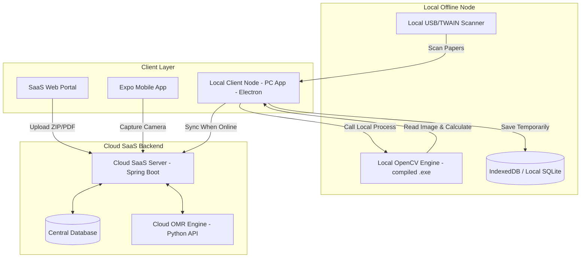

# 📝 হাইব্রিড স্যাস ওএমআর (SaaS OMR) ও স্টুডেন্ট পোর্টাল: আর্কিটেকচারাল ডিজাইন ও রোডম্যাপ

এই ডকুমেন্টে QuestionShaper ইকোসিস্টেমের অধীনে লোকাল পিসি (PC/Electron), ওয়েব এবং মোবাইল অ্যাপ্লিকেশনের সমন্বয়ে গঠিত একটি অত্যন্ত আধুনিক, ফ্লেক্সিবল এবং স্কেলেবল ওএমআর (OMR) ও পরীক্ষা ব্যবস্থাপনা সিস্টেমের নকশা উপস্থাপন করা হলো।

---

## 🏛️ ১. ওএমআর আর্কিটেকচারাল মোডসমূহ (OMR Architecture Modes)
ওএমআর সিস্টেমটি একটি হাইব্রিড আর্কিটেকচারে কাজ করবে, যা অফলাইনে লোকাল পিসিতে হাই-স্পিড প্রসেস করতে পারবে এবং অনলাইনে মূল SaaS সার্ভারে ডাটা সিঙ্ক করবে।



### ক. লোকাল পিসি প্রসেসিং মডেল (PC/Desktop Version)
* **প্রযুক্তির সংমিশ্রণ:** Electron.js (যা আমাদের রিয়াক্ট ফ্রন্টএন্ড কোডকে সরাসরি ডেক্সটপ অ্যাপ হিসেবে রান করাবে)।
* **লোকাল স্ক্যানার ইন্টিগ্রেশন:** Electron অ্যাপটি লোকাল কম্পিউটারের USB স্ক্যানার লাইব্রেরি (যেমন: TWAIN বা WIA ড্রাইভার) সরাসরি রিড করতে পারবে।
* **লোকাল কম্পিউটার ভিশন ইঞ্জিন:** পাইথন স্ক্রিপ্টটিকে PyInstaller বা PyOxidizer দিয়ে একটি সিঙ্গেল বাইনারি এক্সিকিউটেবল ফাইলে (`omr_scanner.exe`) কম্পাইল করা হবে এবং ডেক্সটপ অ্যাপের সাথে বান্ডেল হিসেবে ডিস্ট্রিবিউট করা হবে।
* **অফলাইন ফেইলসেফ:** ইন্টারনেট না থাকলে Electron অ্যাপটি লোকাল ডাটাবেসে (SQLite বা IndexedDB) ওএমআর প্রসেসিংয়ের ডাটা ও ওএমআর ইমেজের ক্রপড ভিউ সেভ করে রাখবে। ইন্টারনেট কানেকশন ফিরে আসার সাথে সাথে তা ব্যাকগ্রাউন্ডে স্প্রিং বুট সার্ভারে পুশ হবে।

### খ. ক্লাউড ওয়েব ও মোবাইল প্রসেসিং মডেল (Web & Mobile Version)
* শিক্ষকরা ড্যাশবোর্ড থেকে জিপ বা পিডিএফ ফাইল আপলোড করতে পারবেন। ব্যাকএন্ডে হোস্ট করা পাইথন স্ক্রিপ্ট ফাইলটি প্রসেস করবে।
* মোবাইল অ্যাপ দিয়ে ছবি তুললে তা সরাসরি সার্ভারের `POST /api/v1/exams/{id}/omr/scan-single` এপিআই-তে পাঠিয়ে কয়েক সেকেন্ডের মধ্যে ফলাফল পপআপ করা হবে।

---

## 📑 ২. ওএমআর শিটের দ্বিমুখী ডিজাইন (Dual OMR Sheet Design)
সিস্টেমে ২ ধরনের ওএমআর ডিজাইন সাপোর্ট করবে:

### মোড ১: জেনেরিক ওএমআর শিট (Generic OMR)
* **ব্যবহার:** যেকোনো সাধারণ পরীক্ষা বা ক্লাসরুম সারপ্রাইজ টেস্টে।
* **গঠন:**
  - ৫ বা ৬ কলামের একটি Roll Number Bubble Grid থাকবে (০-৯ পর্যন্ত বাবল)। শিক্ষার্থীরা পরীক্ষা শুরু করার আগে তাদের রোল নিজেরা ভরাট করবে।
  - ওএমআর এ কোনো প্রাক-মুদ্রিত শিক্ষার্থীর তথ্য থাকবে না।
* **OpenCV লজিক:** ইমেজ প্রসেস করার সময় OpenCV প্রথমে রোল গ্রিড রিড করবে এবং সেই রোল দিয়ে ডাটাবেসে স্টুডেন্ট আইডি ম্যাচ করাবে।

### মোড ২: পারসোনালাইজড কিউআর ওএমআর শিট (Personalized QR OMR)
* **ব্যবহার:** চূড়ান্ত পরীক্ষা, মডেল টেস্ট বা অর্ধবার্ষিক/বার্ষিক পরীক্ষায়।
* **গঠন:**
  - শিটের ওপরের অংশে শিক্ষার্থীর নাম, ক্লাস, সেকশন এবং রোল প্রাক-মুদ্রিত থাকবে।
  - পাশে একটি QR Code থাকবে, যাতে `{ "exam_id": "EX-501", "student_id": "ST-9021" }` ডাটা এনকোড করা থাকবে।
  - এতে কোনো রোল বাবলের গ্রিড থাকবে না।
* **OpenCV লজিক:** ওএমআর প্রসেসিংয়ের সময় OpenCV সরাসরি কিউআর কোড রিড করে সেকেন্ডের মধ্যে স্টুডেন্ট আইডি ও এক্সাম আইডি ডিটেক্ট করে ফেলবে। কোনো ভুল রোলের সুযোগ থাকবে না।

---

## ✍️ ৩. লিখিত পরীক্ষার নম্বর ভরাট গ্রিড (Teacher-Use CQ Marks Grid)
এমসিকিউ ও লিখিত পরীক্ষার খাতা মূল্যায়নের সমন্বয়নের জন্য ওএমআর শিটের নিচের অংশে একটি বিশেষ "শুধুমাত্র পরীক্ষক কর্তৃক পূরণীয়" (Examiner Use Only) বাবল গ্রিড থাকবে।

```
┌────────────────────────────────────────────────────────┐
│               EXAMINER USE ONLY (CQ MARKS)             │
│  CQ 1       CQ 2       CQ 3       CQ 4       CQ 5      │
│  (0) (0)    (0) (0)    (0) (0)    (0) (0)    (0) (0)   │
│  (1) (1)    (1) (1)    (1) (1)    (1) (1)    (1) (1)   │
│   ...        ...        ...        ...        ...      │
│  (9) (9)    (9) (9)    (9) (9)    (9) (9)    (9) (9)   │
└────────────────────────────────────────────────────────┘
```
* **কাজের প্রসেস:**
  - শিক্ষক যখন ওএমআর এর সাথে সংযুক্ত লিখিত খাতাটি মূল্যায়ন করবেন, তখন প্রাপ্ত নম্বর (যেমন: CQ 1 এ ৮ নম্বর পেলে ০ এবং ৮ বাবল ভরাট করবেন) ওএমআর শিটের এই নির্দিষ্ট বক্সে ভরাট করে দেবেন।
  - খাতাটি স্ক্যান করার সময় OpenCV একই সাথে এমসিকিউ বাবল এবং শিক্ষকের ভরাট করা লিখিত পরীক্ষার নম্বরের বাবল রিড করে নেবে।
  - সিস্টেম স্বয়ংক্রিয়ভাবে শিক্ষার্থীর এমসিকিউ এবং সিকিউ (CQ) মার্কস একত্রিত করে মোট জিপিএ বা গ্রেড শিট তৈরি করবে।

---

## 🔑 ৪. শিক্ষার্থী রেজিস্ট্রেশন ও লগইন ফ্লো (Student Registration Flow)
শিক্ষার্থীরা ইআরপি সিঙ্কের আগে সরাসরি কোয়েশ্চেনশেপারে নিজেদের রেজিস্টার করতে পারবে।

```
শিক্ষার্থী ───► নাম, ইমেইল, মোবাইল, ক্লাস, রোল ও পাসওয়ার্ড ইনপুট ───► POST /api/v1/auth/student/register
                                                                           │
                                                                   রোল ও ক্লাস ভ্যালিডেশন
                                                                           ▼
স্টুডেন্ট ড্যাশবোর্ড ◄─── JWT Token & User Profile ◄─── Success ◄─── Save User & ROLE_STUDENT (DB)
```

### রেজিস্ট্রেশন ডেটা মডেল:
* প্রতিটি নিবন্ধিত শিক্ষার্থীর ডাটাবেসে `users` টেবিলে এন্ট্রি হবে এবং তাদের রোলে `ROLE_STUDENT` যুক্ত হবে।
* `class_subject_id` বা `class_id` এর মাধ্যমে শিক্ষার্থীকে তার নির্দিষ্ট ক্লাসের সাথে ট্যাগ করা হবে, যাতে সে শুধুমাত্র তার ক্লাসের পরীক্ষাগুলো দেখতে পায়।

---

## 🎯 ৫. ওএমআর ইঞ্জিনের কারিগরি কর্মপদ্ধতি (How OpenCV Processes the Layout)
লোকাল বা ক্লাউড যেখানেই ওএমআর রান করুক, প্রসেসিং পাইপলাইনটি নিচের ডায়াগ্রামের নিয়ম মেনে কাজ করবে:

```
Raw Scanned Image
       │
       ▼
Grayscale & Gaussian Blur
       │
       ▼
Adaptive Thresholding
       │
       ▼
Find Contours & Detect 4 Anchor Marks
       │
       ▼
Warp Perspective - Rectify to 800x1200
       │
       ▼
Read QR Code ──────► (Found) ──────► Get Student ID & Exam ID from QR
       │                                             │
   (Not Found)                                       ▼
       │                                     Crop MCQ Answer Grid
       ▼                                     & Read MCQ Bubbles
Crop Roll Area -> Read Roll Bubbles                  │
       │                                             ▼
       └─────────────────────────► Crop Teacher CQ Grid -> Read Written Marks
                                                     │
                                                     ▼
                                     Calculate Score & Output JSON Result
```

---

## 📅 ৬. ধাপে ধাপে বাস্তবায়ন পরিকল্পনা (Detailed Execution Phase)

আমরা পুরো সিস্টেমের কাজকে ৫টি মডিউল বা ধাপে ভাগ করে সম্পন্ন করব:

### 🟢 মডিউল ১: স্টুডেন্ট পোর্টাল ও অনলাইন এক্সাম গেটওয়ে (Student Base Portal)
* **ডাটাবেস আপডেট:** `users` টেবিলে `student_roll`, `class_id` যুক্ত করা।
* **এপিআই তৈরি:** শিক্ষার্থীদের ক্লাস-ভিত্তিক একটিভ পরীক্ষা খোঁজা, পরীক্ষার প্রশ্ন ডেলিভারি ও সাবমিশন হ্যান্ডলার।
* **ইউজার ইন্টারফেস (UI):**
  - স্টুডেন্ট সাইন-আপ ও লগইন স্ক্রিন।
  - এক্সাম টেকার পোর্টাল (টাইমার, অটো-সেভ লজিকসহ)।
  - রেজাল্ট ও টপিক-ভিত্তিক অ্যানালিটিক্স চার্ট।

### 🟢 মডিউল ২: ওএমআর শিট জেনারেটর পিডিএফ ইঞ্জিন (OMR PDF Generator)
* **ডিজাইন কোডিং:** HTML-CSS লেআউট দিয়ে একটি স্ট্যান্ডার্ড প্রিন্ট রেডি ওএমআর ডিজাইন তৈরি করা।
* **QR জেনারেটর:** পিডিএফ প্রিন্ট করার সময় শিক্ষার্থীর আইডি এবং এক্সাম আইডি সম্বলিত কিউআর কোড হেডার অংশে জেনারেট করা।
* **লেআউট কোঅর্ডিনেট ম্যাপিং:** বাবলগুলোর এক্স-ওয়াই (X, Y) স্থানাঙ্কের একটি স্ট্যান্ডার্ড JSON কনফিগারেশন তৈরি করা যা OpenCV রিড করতে পারবে।

### 🟢 মডিউল ৩: ওএমআর কম্পিউটার ভিশন ইঞ্জিন (OpenCV Parser)
* **পাইথন কোডিং:** `omr_scanner.py` ফাইল স্ক্রিপ্ট রাইটিং।
* **অ্যাঙ্কর ডিটেকশন ও সোজা করা:** ৪টি অ্যাঙ্করের মাধ্যমে ইমেজ রোটেশন ফিক্স করা।
* **বাবল অ্যানালাইসিস:** পিক্সেল ইন্টেনসিটি মেপে বাবল আইডেন্টিফাই করা।
* **শিক্ষক CQ বাবল রিডার:** শিক্ষকের ওএমআর লিখিত নম্বর ভরাট অংশ রিড করার লজিক ডেভেলপ করা।

### 🟢 মডিউল ৪: লোকাল পিসি ক্লায়েন্ট ইন্টিগ্রেশন (Electron & Local Exe Bundling)
* **ডেক্সটপ রিলিজ:** Electron এর ফাইল সিস্টেম এক্সেস সেটআপ করা।
* **PyInstaller কম্পাইলেশন:** পাইথন স্ক্রিপ্টটিকে এক্সিকিউটেবল ফাইলে রূপান্তর করে ডেক্সটপ অ্যাপের সাথে বান্ডেল করা।
* **লোকাল স্ক্যান ফোল্ডার ওয়াচার:** স্ক্যানার থেকে সরাসরি ইমেজ ফাইল রিড করার ওয়াচার মেকানিজম।

### 🟢 মডিউল ৫: ডাটা সিঙ্ক ও ফাইনাল পলিশিং (Sync & Queue Engine)
* **স্প্রিং বুট ইন্টিগ্রেশন:** আপলোডেড ওএমআর ফাইলগুলো কিউ এর মাধ্যমে প্রসেস করার সিডিউলার তৈরি।
* **লাইভ রেজাল্ট সিঙ্ক:** অফলাইন ডাটা অনলাইনে অটোমেটিক সিঙ্ক করার রি-ট্রাই মেকানিজম।
