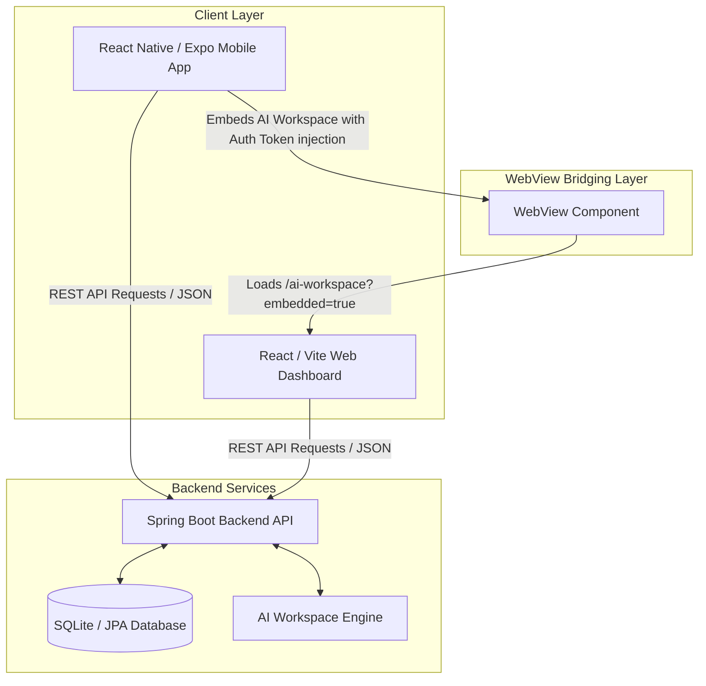

# Project Architecture & Structural Overview

Welcome to the **QuestionShaper** unified workspace. This project is structured as a coordinated mono-repository supporting a full-stack ecosystem consisting of a Spring Boot backend, a Vite + React web application, and an Expo + React Native mobile application.

---

## ─── 🏗️ High-Level System Architecture ───

The system uses a unified REST API backend, with the frontend acting both as a standalone web dashboard and as an embedded sub-application inside the mobile WebView.



---

## ─── 📁 Directory Structures & Module Roles ───

### 1. Backend (`/backend`)
The backend is an enterprise-grade **Spring Boot** application utilizing a SQLite database, Spring Security, and JPA/Hibernate.

* **`/src/main/java/com/testshaper`**:
  * `QuestionShaperApplication.java`: Main entry point for the Spring Boot application.
  * `controller/`: REST controllers exposing endpoints for authentication, exam creation, curriculum navigation, and system settings.
  * `service/`: Core business logic, caching layers, and transaction management.
  * `repository/`: Spring Data JPA interfaces for database CRUD operations.
  * `entity/`: Database relational model mapping files.
  * `security/`: Spring Security configurations, custom JWT token extraction, and role-based path permissions.
  * `dto/`: Data Transfer Objects for API request validation and response normalization.
  * `modules/`: Feature-specific modules, such as the AI Question Generator.
  * `config/`: Application beans, CORS settings, database configurations, and web MVC interceptors.
* **`pom.xml`**: Maven dependency declaration, packaging configurations, and build lifecycles.

---

### 2. Frontend Web Application (`/frontend`)
A modern, high-performance web dashboard built using **Vite + React**, **TailwindCSS**, and **Lucide Icons**.

* **`/src`**:
  * `App.jsx`: Root router containing path routes, sidebar wrapper injections, and protected route handlers.
  * `index.css`: Global styles, typography tokens, scrollbar customizations, and glassmorphic utility rules.
  * `layouts/`: Master structural blueprints (e.g., dashboard shell, collapsible sidebar navigation, top bar).
  * `pages/`: Page components grouped by domain:
    * `admin/AIWorkspace/`: The AI Workspace platform, including `AiWorkspace.jsx`, custom tool managers (`AiToolManager.jsx`), and interactive widget builders like the **Magic Exam Generator** (`AutoExamWizardWidget.jsx`).
    * Other primary features (Exams, Question Banks, Proofreading, System Settings).
  * `components/`: UI kits (buttons, inputs, glass cards, sliders, real-time search inputs).
  * `context/`: Application state providers (Auth contexts, theme managers, dynamic institute branding).
  * `services/`: Axios HTTP API integrations mapped to backend endpoints with built-in client-side caching.
  * `utils/`: Common helpers, date converters, and calculations.
* **`vite.config.js`**: Vite bundler compiler configurations, local proxy mappings, and output targets.

---

### 3. Mobile Application (`/mobile`)
A hybrid cross-platform application developed with **Expo (React Native)** and **TypeScript** targeted at unified tablet and phone compatibility.

* **`/src`**:
  * `screens/`: Core user views:
    * `DashboardScreen.tsx`: Central hub featuring interactive stat counters, custom activities lists, and a sleek bottom tab layout.
    * Home, Profile, Notifications, and Saved Exams screens.
  * `api/`: API clients (`apiClient.ts` resolving target environment variables dynamically like `LOCAL_DEV_IP`) and endpoint wrappers (`cmsService.ts`).
  * `context/`: Core states:
    * `AuthContext.tsx`: Tracks tokens, manages background secure storage, and triggers immediate state updates.
    * `BrandingContext.tsx`: Feeds custom client logo assets and system names globally.
  * `theme/`: Theme system definitions including modern HSL color tokens, typography weights, and iOS/Android shadow mappings.
  * `locales/`: Localization configuration supporting multiple translation scopes.
* **`App.tsx`**: Main mobile launcher routing authentication states, splash loaders, and core app layouts.
* **`app.json`**: Expo configuration specifying device assets, package bundles, and dynamic build setups.

---

## ─── 🔄 Dynamic Mobile-Web Integration & Bridging ───

One of the premium architectures of QuestionShaper is the **seamless WebView Integration** for high-complexity features like the **AI Workspace**.

### 🔑 Dynamic Auth Injection
Instead of forcing users to authenticate twice, the React Native application securely injects local authentication tokens directly into the embedded WebView browser context:

```typescript
// Inside DashboardScreen.tsx WebView mounting
injectedJavaScriptBeforeContentLoaded={`
  try {
    localStorage.setItem('token', '${token}');
    localStorage.setItem('user', JSON.stringify(${JSON.stringify(user)}));
  } catch(e) {}
  true;
`}
```

### 📱 Responsive Layout Adaptation
When the web application detects that it is rendered inside a mobile device (`?embedded=true`), it dynamically adjusts its styling:
1. **Paddings**: Outer card paddings shift from standard desktop spacing (`p-6`) to low-padding responsive variables (`p-1.5` on mobile viewports under 360px).
2. **Full-Viewport Focus**: All sidebars, navigation headers, welcome chats, and inputs are hidden when a tool is selected. The tool widget expands to 100% width (`max-w-2xl` layout max) alongside a "Back to Chat" navigation header.

---

## ─── 🚀 Co-Development Best Practices ───

1. **Keep Mobile WebView Parameters Synchronized**:
   Always verify that changes to token schemas or context configurations in `/frontend` are mirrored inside the `injectedJavaScript` scripts of `/mobile/src/screens/DashboardScreen.tsx`.

2. **Verify Mobile Aspect Ratios**:
   When editing widgets like `AutoExamWizardWidget.jsx` in the frontend, ensure that grid columns collapse to single rows on viewports under `768px` to guarantee standard tap targets.

3. **Validate Production Bundles**:
   Running web or mobile enhancements should always end with clean builds:
   * Web: `npm run build` inside `/frontend`
   * Mobile: `npx expo lint` / compilation sanity checks
